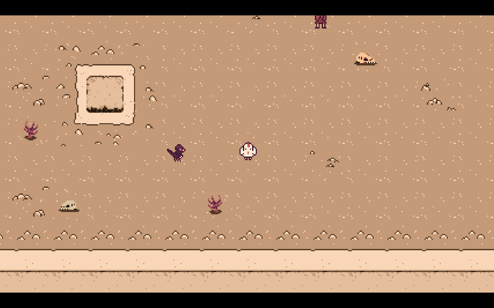
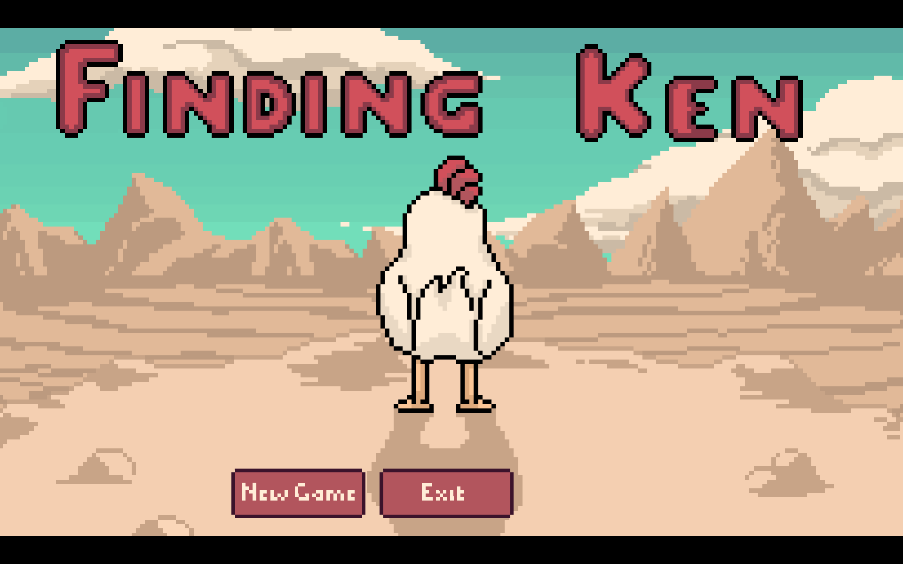
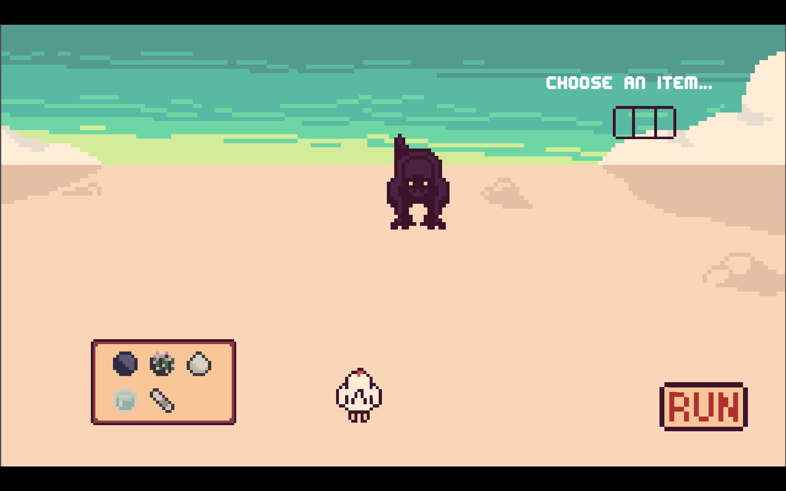

# 🐔 Finding Ken

Help Chic find their cousin, Ken, who is lost in a world full of prehistoric creatures.  
Explore the Cretaceous landscape, collect items, confront dinosaurs, and reunite these two chickens lost in a strange world.

---

## 🎮 Gameplay
- Traverse a mysterious prehistoric world filled with dinosaurs.
- Collect items to aid your journey.
- Encounter dinosaurs in tense moments — sometimes running is the only option!
- Advance through dialogue-driven cutscenes to uncover the story.

---

## 🕹️ Controls
- **W** – Move up  
- **S** – Move down  
- **A** – Move left  
- **D** – Move right  
- **E** – Interact  
- **Space / Return / Left Mouse Button** – Advance dialogue  

---

## ✨ Credits
- **Clerami** – Game development, programming, cutscene implementation, and overall game direction  
- **tine** – Art, animation, story writing, and gameplay mechanics  
- **Cachoumi** – Story concept, mechanics concept, bespoke sound effects, and original music  

---

## 🌱 About
Created for **Comfy Summer Game Jam 2026**.  
A cozy yet adventurous game blending exploration, light survival, and quirky chicken humor.

---

## 🎮 Play Online
You can play the game directly on itch.io:
👉 Finding Ken on https://clerami.itch.io/finding-ken

## 📸 Screenshots

  
  

